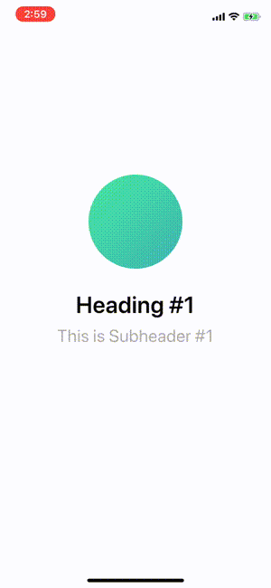

# CarouselAnimation

### Purpose:
I saw that the xfinity iOS app has a pretty cool carousel animation on their onboarding screen. Since I wanted more practice with iOS animations (specifically layer animations), I decided to see if I can reproduce some of the animations. The original version and my version are shown below.

| xfinity app | my code    |
| :------------- | :------------- |
|       |        |

### Disclaimer:
This is just a POC and the code itself is far from pristine.
